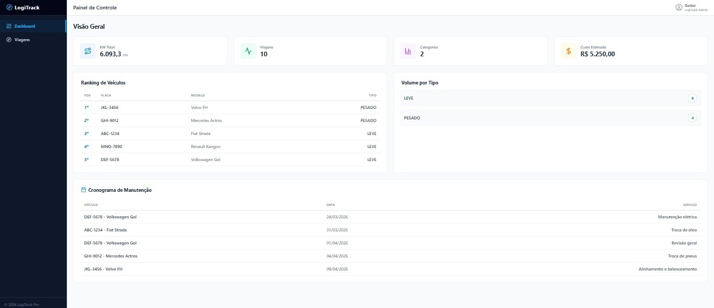
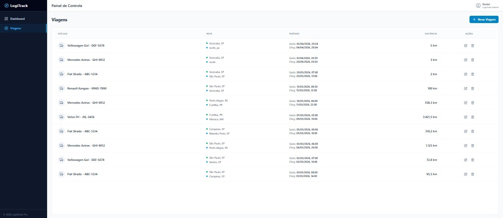
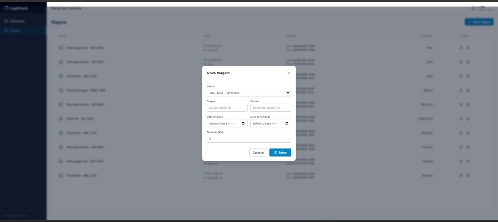

# LogiTrack - Sistema de Gestão de Frota

[](https://reactjs.org/)
[](https://www.typescriptlang.org/)
[](https://vitejs.dev/)
[](https://tailwindcss.com/)

**LogiTrack** é uma solução moderna de frontend desenvolvida para otimizar o monitoramento e a gestão de frotas logísticas. O sistema oferece uma interface rica para visualização de métricas críticas, permitindo o acompanhamento de quilometragem, rankings de veículos e cronogramas de manutenção em tempo real.

---

## Screenshots

### Dashboard (Visão Geral)


### Lista de Viagens


### Adição de Viagens


---

## Endpoints Consumidos

A integração com o backend é realizada através dos seguintes recursos:

- `GET /dashboard/total-km`: Métricas globais de quilometragem.
- `GET /dashboard/volume-por-tipo`: Distribuição por categoria de frota.
- `GET /dashboard/ranking-veiculos`: Ranking de performance por veículo.
- `GET /dashboard/proximas-manutencoes`: Agenda de manutenções futuras.
- `GET /dashboard/projecao-custo`: Dados financeiros projetados.
- `GET /viagens`: Listagem paginada de operações.
- `POST /viagens`: Registro de novos trajetos.
- `PUT /viagens/{id}`: Atualização de dados existentes.
- `DELETE /viagens/{id}`: Remoção de registros operacionais.
- `GET /veiculos`: Catálogo de veículos disponíveis.

---

## Funcionalidades

- **Métricas de Analytics**:
  - `Distância Percorrida Total`: Somatório global de KM.
  - `Volume por Categoria`: Classificação entre frotas Leves e Pesadas.
  - `Top Fleet (Ranking)`: Identificação dos veículos com maior rodagem.
- **Ecossistema de Manutenção**: Listagem inteligente das próximas intervenções agendadas.
- **Controle Financeiro**: Projeção de custos operacionais baseada em dados históricos.
- **Gestão de Operações (CRUD)**:
  - Listagem paginada e eficiente.
  - Criação e edição de viagens com validações avançadas.
  - Exclusão segura com confirmação.

---

## Stack Técnica

- **Core**: [React](https://reactjs.org/) + [TypeScript](https://www.typescriptlang.org/)
- **Build Tool**: [Vite](https://vitejs.dev/)
- **Styling**: [Tailwind CSS](https://tailwindcss.com/)
- **API Client**: [Axios](https://axios-http.com/)
- **Icons**: [Lucide React](https://lucide.dev/)

---

## Configuração e Instalação

### Pré-requisitos
- **Node.js**: v18+
- **Backend**: Certifique-se de que o [LogiTrack Backend](https://github.com/geovannaadomingos/logitrack-backend) esteja rodando.

### Passo a Passo

1. **Clone o repositório**
   ```bash
   git clone https://github.com/geovannaadomingos/logitrack-frontend.git
   cd logitrack-frontend
   ```

2. **Instale as dependências**
   ```bash
   npm install
   ```

3. **Inicie o servidor de desenvolvimento**
   ```bash
   npm run dev
   ```

---

## Variáveis de Ambiente

O projeto utiliza variáveis de ambiente para definir a URL da API, facilitando a troca entre ambientes (desenvolvimento, homologação, produção).

Crie um arquivo `.env` na raiz do projeto:

```env
VITE_API_URL=http://localhost:8080/api/v1
```

No código, a configuração é consumida dinamicamente:
```ts
baseURL: import.meta.env.VITE_API_URL || 'http://localhost:8080/api/v1'
```

---

## Fluxo de Dados

A arquitetura garante uma separação clara de responsabilidades seguindo o fluxo:

1. **Interface (React)**: O usuário interage com os componentes (Dashboard, Modais).
2. **Service Layer (`src/services/api.ts`)**: Chamadas HTTP são disparadas via Axios.
3. **Backend (Spring Boot)**: A requisição é processada com validações de negócio.
4. **Data Transfer (JSON)**: Os dados retornam formatados em DTOs.
5. **Estado & UI**: O React atualiza o estado local e re-renderiza os componentes com os dados reais.

---

## Regras de Negócio (Frontend)

Para garantir a integridade dos dados antes mesmo do envio ao servidor, o frontend implementa:
- **Validadores de Data**: Bloqueio de datas inválidas ou formatos incorretos.
- **Ordem Cronológica**: A data de saída deve ser obrigatoriamente anterior à data de chegada.
- **Consistência de KM**: A distância percorrida deve ser sempre maior que zero.
- **Campos Obrigatórios**: Validação rigorosa de todos os campos essenciais antes da liberação do botão de salvar.

---

## Deploy

O frontend está preparado para ser hospedado em plataformas como **Vercel** ou **Netlify**.

### Build de Produção
```bash
npm run build
```

### Configuração Recomendada (ex: Netlify)
- **Build command**: `npm run build`
- **Publish directory**: `dist`
- **Variáveis de Ambiente**: Configure `VITE_API_URL` apontando para a sua API em produção.

---

## Arquitetura do Projeto

```text
src/
├── components/   # Componentes de UI (Modais, Sidebar, Tabelas)
├── pages/        # Telas da aplicação (Dashboard, Viagens)
├── services/     # Integração com API (Axios instance)
├── types/        # Definições de interfaces TypeScript
└── utils/        # Funções auxiliares (Máscaras, Formatação de data)
```

---

## Melhorias Futuras

- **Autenticação**: Implementação de login seguro (JWT).
- **Filtros Avançados**: Busca dinâmica por data, placa e motorista.
- **Exportação**: Geração de relatórios em PDF/Excel.

## Testes (Futuro)

Planejado para garantir a robustez do sistema:
- **Unitários & Integração**: Uso de [Jest](https://jestjs.io/) e [React Testing Library](https://testing-library.com/docs/react-testing-library/intro/) para componentes e hooks.
- **E2E**: Implementação de fluxos críticos com [Cypress](https://www.cypress.io/).

---

## Autor

**Geovanna Domingos** - [GitHub](https://github.com/geovannaadomingos)
